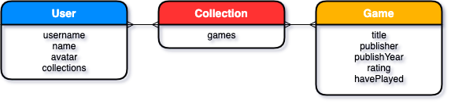
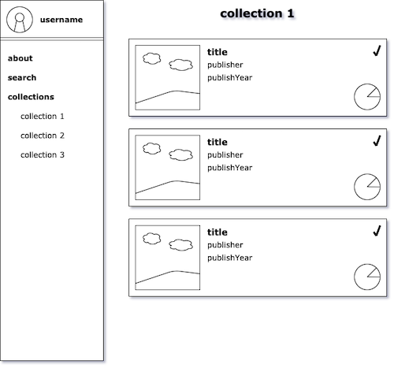

# 8-Bit-Archive

### Date: 3/27/2020

#### By:
#### Michael Lackey
#### [GitHub](https://github.com/mlackey9601) | [LinkedIn](https://www.linkedin.com/in/michaelglackey/)
#### 
#### Alan McCracken
#### [GitHub](https://github.com/acmccracken) | [LinkedIn](https://www.linkedin.com/in/alancmccracken/)
#### 
#### Tan Vu
#### [GitHub](https://github.com/zeroxposur18) | [LinkedIn](https://www.linkedin.com/in/tan-m-vu/)
***

### ***Description***

##### 8-Bins is a video game tracking application that allows anyone to find video games and add them to their collection.
***

### ***Technologies Used***

* ##### HTML
* ##### CSS
* ##### JavaScript
* ##### Python/Django
* ##### Heroku
***

### ***Getting Started***

##### Put a short description of how to get started with the app here.
##### A Trello board was used to keep track of development progress and can be viewed [here](https://trello.com/b/8ada8teB/video-game-tracker).
##### The project itself was deployed using Heroku and can be viewed [here]().
***

### ***Screenshots***

###### Entity Relationship Diagram

###### Wireframe

###### Screenshot

***

### ***User Experience***

#### User Story #1
##### Billy loves playing video games and wants a place where he can keep track of all of the video games he's played.
#### User Story #2
##### Jennifer is new to video games and wants to keep a list of games that have been recommended by her friends.
#### As a user...
* ##### I should be able to create an account with a unique username, name, avatar.
* ##### I should be able to search for and find a video game.
* ##### I should be able to create a collection of video games.
* ##### I should be able to add/remove/update video games in my collection.
***

### ***Future Updates***

- [ ] Allow users to search through a large database of video games via external API
- [ ] Make app completely scalable for mobile
- [ ] Allow the user to rate games in their collections
- [ ] Allow users to apply category tags to their collections
- [ ] Add animations/interactive styling
***

### ***Credits***

##### External API: [Internet Gaming Database (IGDB)](https://api.igdb.com/)
***