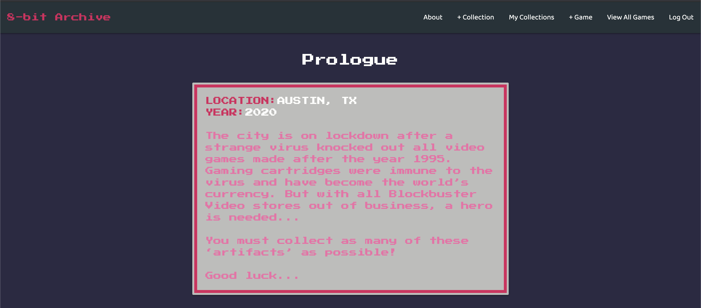
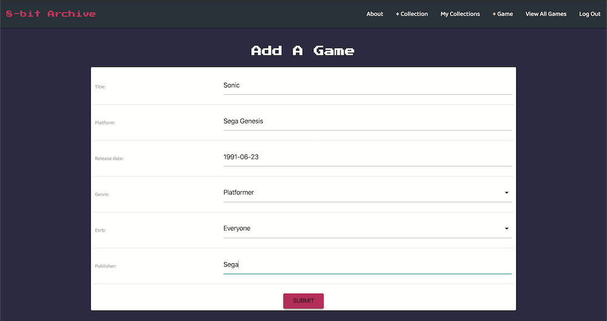
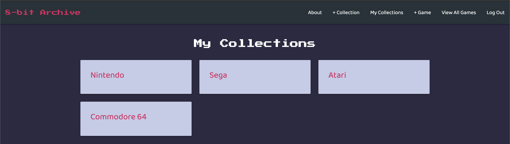

# 8-Bit Archive

### Date: 3/27/2020

#### By:
#### Michael Lackey
#### [Website](https://michaellackey.com/) | [GitHub](https://github.com/mlackey9601) | [LinkedIn](https://www.linkedin.com/in/michaelglackey/) | [GA Profile](https://profiles.generalassemb.ly/michaellackey)
#### 
#### Alan McCracken
#### [GitHub](https://github.com/acmccracken) | [LinkedIn](https://www.linkedin.com/in/alancmccracken/)
#### 
#### Tan Vu
#### [GitHub](https://github.com/zeroxposur18) | [LinkedIn](https://www.linkedin.com/in/tan-m-vu/)
***

### ***Description***

##### 8-Bit Archive is a video game tracking application that allows anyone to add video games to collections for easy sorting and reference.
***

### ***Technologies Used***

* ##### HTML
* ##### CSS
* ##### JavaScript
* ##### Python/Django
* ##### Postgresql
* ##### Amazon Web Services S3
* ##### Heroku
***

### ***Getting Started***

##### Start off by creating a new user and signing into the app. Once signed in, create a collection and start adding games to it!
##### A pitch deck was made to present this project and can be viewed [here](https://docs.google.com/presentation/d/1muVt_wu6NYyIGrlFx8TLKlcdeXdpLRrIhugt0gI5g-M/edit?usp=sharing).
##### A Trello board was used to keep track of development progress and can be viewed [here](https://trello.com/b/8ada8teB/video-game-tracker).
##### The project itself was deployed using Heroku and can be viewed [here](https://eight-bit-archive.herokuapp.com/).
***

### ***Screenshots***

###### About Page

###### Add A Game

###### My Collections

***

### ***Future Updates***

- [ ] Allow users to search through a large database of video games via external API
- [ ] Make app completely scalable for mobile
- [ ] Allow the user to rate games in their collections
- [ ] Allow users to apply category tags to their collections
- [ ] Add animations/interactive styling
***
